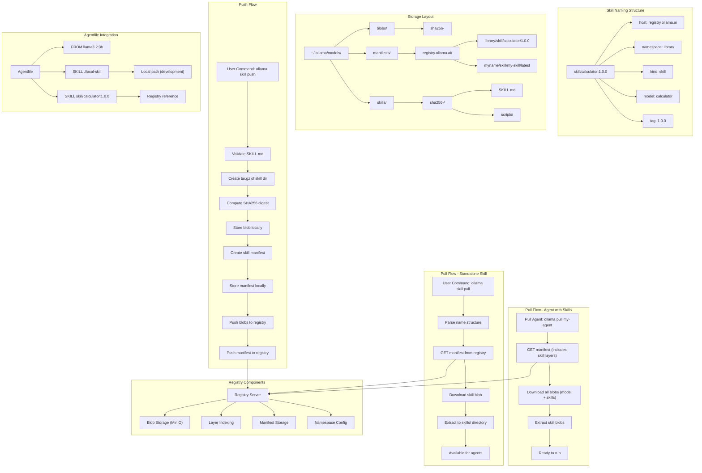

# Skill Registry Design

## Overview

Skills are distributable capability packages for Ollama agents. They can be:
- Bundled with agents at creation time (local paths)
- Pulled from the registry (skill references)
- Pushed to the registry for sharing

## User Experience

### Push a Skill

```bash
# Push a local skill directory to the registry
ollama skill push myname/calculator:1.0.0 ./skills/calculator-skill

# Output:
# Creating skill layer for skill/myname/calculator:1.0.0
# pushing sha256:abc123... 1.2KB
# pushing sha256:def456... 220B
# pushing manifest
# Successfully pushed skill/myname/calculator:1.0.0
```

### Pull a Skill

```bash
# Pull a skill from the registry
ollama skill pull calculator:1.0.0

# Output:
# pulling manifest
# pulling sha256:abc123... 1.2KB
# extracting skill...
# Successfully pulled skill/calculator:1.0.0
```

### List Installed Skills

```bash
ollama skill list

# Output:
# NAME                      TAG     SIZE     MODIFIED
# skill/calculator          1.0.0   1.2 KB   2 hours ago
# skill/myname/hello        latest  0.8 KB   1 day ago
```

### Remove a Skill

```bash
ollama skill rm calculator:1.0.0
# Deleted 'skill/calculator:1.0.0'
```

### Use Skills in Agentfile

```dockerfile
FROM llama3.2:3b

AGENT_TYPE conversational
SKILL skill/calculator:1.0.0    # Registry reference
SKILL ./local-skill             # Local path (for development)

SYSTEM You are a helpful assistant.
```

## Technical Implementation

### Skill Manifest Format

```json
{
  "schemaVersion": 2,
  "mediaType": "application/vnd.docker.distribution.manifest.v2+json",
  "config": {
    "mediaType": "application/vnd.docker.container.image.v1+json",
    "digest": "sha256:config...",
    "size": 220
  },
  "layers": [
    {
      "mediaType": "application/vnd.ollama.image.skill",
      "digest": "sha256:skill...",
      "size": 1234
    }
  ]
}
```

### Skill Config Format

```json
{
  "name": "calculator",
  "description": "A skill for performing calculations",
  "architecture": "amd64",
  "os": "linux"
}
```

### Storage Layout

Skills use a 5-part manifest structure: `host/namespace/kind/model/tag`

```
~/.ollama/models/
├── blobs/
│   └── sha256-<skill-digest>           # Skill tar.gz blob
├── manifests/
│   └── registry.ollama.ai/
│       └── library/
│           └── skill/                  # Kind = skill
│               └── calculator/
│                   └── 1.0.0
│       └── myname/
│           └── skill/                  # User skills
│               └── my-skill/
│                   └── latest
└── skills/
    └── sha256-<digest>/                # Extracted skill cache
        ├── SKILL.md
        └── scripts/
```

### Name Structure

Skills use a 5-part name structure with `kind` to distinguish from models:

| Skill Reference | Namespace | Kind | Model | Tag |
|-----------------|-----------|------|-------|-----|
| `skill/calculator:1.0.0` | library | skill | calculator | 1.0.0 |
| `myname/skill/calc:latest` | myname | skill | calc | latest |

### Media Type

```go
const MediaTypeSkill = "application/vnd.ollama.image.skill"
```

### Key Types

```go
// SkillRef represents a skill reference in agent config
type SkillRef struct {
    Name   string `json:"name,omitempty"`   // "calculator-skill" or "myname/skill/calc:1.0.0"
    Digest string `json:"digest,omitempty"` // "sha256:abc..." (set when bundled)
}

// model.Name represents a parsed 5-part name
type Name struct {
    Host      string // "registry.ollama.ai"
    Namespace string // "library" or "myname"
    Kind      string // "skill" or "agent" or "" for models
    Model     string // "calculator"
    Tag       string // "1.0.0"
}
```

## Implementation Files

### Client (ollama)

| File | Purpose |
|------|---------|
| `server/skill.go` | Skill blob handling, path parsing, extraction |
| `cmd/skill_cmd.go` | CLI commands (push, pull, list, rm, show) |
| `cmd/skills.go` | Skill loading and catalog management |
| `server/create.go` | Skill layer creation during agent create |
| `server/images.go` | Skill extraction during pull |
| `types/model/config.go` | SkillRef type definition |

### Registry (ollama.com)

| File | Purpose |
|------|---------|
| `ollamadotcom/registry/store.go` | MediaTypeSkill constant |
| `ollamadotcom/store/store.go` | RecordPush handles skill layers |

## Registry Integration

### What Works

- Blob uploads (content-addressable, no auth required)
- Layer indexing (skill layers stored with mediatype)
- Manifest structure (4-part path compatible)

### What's Needed

1. **Namespace Configuration**: The `skill` namespace needs to be configured with:
   - Public read access
   - Authenticated write access

2. **Permission Model**: Decide who can push to `skill/` namespace:
   - Only Ollama team (curated library)
   - Verified publishers
   - Anyone (open registry)

## Pull Flow

### Agent with Bundled Skills

```
ollama pull my-agent
    → GET manifest (includes skill layers)
    → Download all blobs (model + skills)
    → Extract skill blobs to ~/.ollama/models/skills/
    → Ready to run
```

### Standalone Skill

```
ollama skill pull calculator:1.0.0
    → Parse as skill/calculator:1.0.0
    → Convert to model.Name{Namespace: "skill", Model: "calculator", Tag: "1.0.0"}
    → GET manifest from registry
    → Download skill blob
    → Extract to ~/.ollama/models/skills/sha256-<digest>/
    → Available for agents to reference
```

## Push Flow

```
ollama skill push myname/calculator:1.0.0 ./my-skill
    → Validate SKILL.md exists
    → Create tar.gz of skill directory
    → Compute SHA256 digest
    → Store blob locally
    → Create skill manifest with config layer
    → Store manifest locally
    → Push blobs to registry
    → Push manifest to registry
```

## Backward Compatibility

- Old agents with `Skills: []string` (paths) continue to work
- New agents use `Skills: []SkillRef` with name and digest
- Parser detects format and handles both

## Local Registry Testing

To test push/pull locally, you need MinIO and the Docker registry running:

```bash
# 1. Start MinIO (for blob storage)
minio server ~/.minio-data --console-address ':9001' &

# 2. Create the ollama-dev bucket (first time only)
mc config host add local http://localhost:9000 minioadmin minioadmin
mc mb local/ollama-dev

# 3. Start the registry (from ollama.com repo)
cd /path/to/ollama.com/registry
go run cmd/registry/main.go serve config-dev.yml &

# 4. Verify registry is running
curl http://localhost:6000/v2/
```

**Important:** The `config-dev.yml` must have matching ports:
```yaml
http:
  addr: :6000
  host: http://localhost:6000  # Must match addr!
```

### Test Commands

```bash
# Push skill from local folder
ollama skill push localhost:6000/testuser/skill/calculator:1.0.0 ./skills/calculator-skill --insecure

# Pull skill from registry
ollama skill pull localhost:6000/testuser/skill/calculator:1.0.0 --insecure

# List skills
ollama skill list

# Show skill
ollama skill show localhost:6000/testuser/skill/calculator:1.0.0
```

## Architecture Diagram


